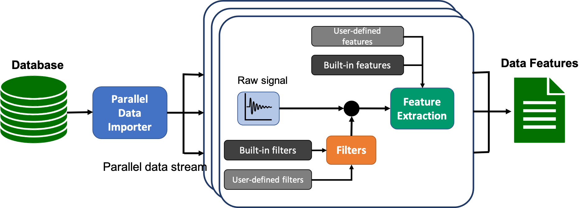

# Feature Extraction Pipeline

```cmda.pipeline.Pipeline``` is a tool for importing, pre-processing and feature extraction of multiple records (files) in an automated manner.

User must create an [*importer*](./import_data.md) object, a [*feature*](./feature_object.md) object, and if required a [*filter*](./filter_object.md) object. then feed these object into the pipeline.
The feature extraction can be done either consecutively or in parallel.
The pipeline workflow is shown in the following diagram:



An example of using the pipeline can be found [here](../examples/pipeline.ipynb)